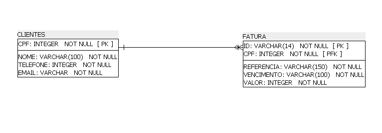

# 🎯 **Sobre o projeto: Sistema de Controle de Sócios Torcedores do SC Brasil:**

O projeto desenvovlido, consiste em um sistema de controle de sócios torcedores, sendo capaz de administrar a venda de planos para os sócios torcedores.

## 👤 **Integrantes:**

- [Cleverton dos Santos Liltk](github.com/1tsRetr0),
- [Gustavo de Oliveira Christ](github.com/ChRxT09),
- [Jhony Rodrigues de Souza](github.com/jhonyrdesouza),
- [Lucio Ewald do Nascimento](github.com/lucioew28),
- [Wellington da Silva Barbosa Junior](github.com/WellingtonWritesCode)

## 🎬 **Vídeo do projeto:**

- [Link para acesso](https://youtu.be/uo5DjPxPu6w);

## 🧲 **Diagrama relacional:**



## ⚡ **Executando o projeto:**

O projeto desenvido exige que as coleções existam, então basta executar o script Python a seguir para a criação das coleções e preenchimento de dados de exemplos:

Instale as dependencias necessárias para a execução do projeto:

```shell
~$ pip install -r requirements.txt
```

```shell
~$ python create_collections.py
```

Para executar o sistema basta executar o script Python a seguir:

```shell
~$ python app.py
```

### **Bibliotecas Utilizadas:**

- [requirements.txt](src/requirements.txt): `pip install -r requirements.txt`
